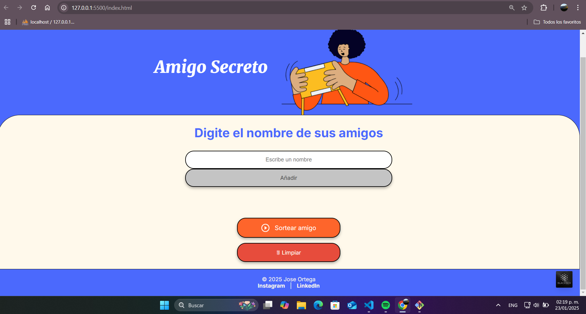

Amigo Secreto

Descripción

Este proyecto es una aplicación web interactiva que permite a los usuarios ingresar nombres de amigos y realizar un sorteo aleatorio para determinar quién será el "amigo secreto". Es ideal para eventos y celebraciones donde se quiere organizar un intercambio de regalos de manera divertida y sencilla.

Características

Agregar nombres a la lista de participantes.

Validación de entradas para evitar elementos vacíos.

Visualización dinámica de los nombres agregados.

Sorteo aleatorio de un amigo secreto.

Botón para limpiar la lista y reiniciar el proceso.

Interfaz responsiva y amigable.

Captura de pantalla

Agrega una captura de pantalla aquí

Tecnologías utilizadas

HTML5 - Estructura del contenido.

CSS3 - Estilos responsivos y atractivos.

JavaScript - Lógica del proyecto para la manipulación de la lista y sorteos.

Instalación

Para ejecutar este proyecto localmente, sigue estos pasos:

Clona este repositorio:

git clone https://github.com/joseorteha/amigo-secreto.git

Navega al directorio del proyecto:

cd amigo-secreto

Abre el archivo index.html en tu navegador favorito.

Uso

Escribe el nombre de un amigo en el campo de entrada.

Presiona el botón "Añadir" para agregarlo a la lista.

Repite el proceso para agregar más amigos.

Presiona el botón "Sortear amigo" para obtener un resultado aleatorio.

Si deseas reiniciar, presiona el botón "Limpiar".

Problemas conocidos

Si experimentas algún problema, revisa lo siguiente:

Asegúrate de que estás ejecutando el archivo index.html en un navegador compatible.

Verifica que tienes habilitado JavaScript en tu navegador.

Contribución

Si deseas contribuir a este proyecto, sigue estos pasos:

Haz un fork del repositorio.

Crea una nueva rama:

git checkout -b feature/nueva-funcionalidad

Realiza tus cambios y confirma los commits:

git commit -m "Agrega nueva funcionalidad"

Sube los cambios a tu fork:

git push origin feature/nueva-funcionalidad

Abre un Pull Request.

Licencia

Este proyecto está bajo la licencia MIT. Consulta el archivo LICENSE para más detalles.

Autor

Desarrollado por Jose Ortega.

